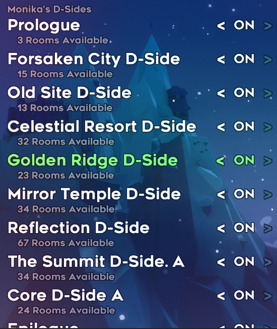

Celeste D-sides Randomizer
==========================
This is a collection of randomizer configuration files and routing descriptions for the [D-sides pack](https://gamebanana.com/maps/202524) of maps for [Celeste](http://www.celestegame.com/). 

The config is designed to be compatible with the [Celeste Randomizer](https://github.com/rhelmot/CelesteRandomizer).

For the best experience, it is recommended to play the D-sides first before playing the randomizer add-on.

Installation
------------
Running mods with Celeste requires you to have installed [Everest](https://everestapi.github.io/).

1. Download the [D-sides pack](https://gamebanana.com/maps/202524).
2. Download the [Celeste Randomizer](https://gamebanana.com/tools/6848).
3. The config is included by default within the D-sides pack, and the D-sides will be available in the randomizer level select screen.

Difficulty Modes
----------------
The difficulties are intended to be equivalent to the vanilla randomizer difficulties, which are defined [here](https://github.com/rhelmot/CelesteRandomizer). The ratings are based on difficulty of execution and assume that you have played the D-sides before. If you haven't, some screens may be harder than the ratings imply. The current difficulty ratings for each screen and other information on routing can be found in the documentation [here](docs/routing). If you find new routes or would like to suggest tweaks or changes to difficulty ratings, feel free to contact me!

Choosing a difficulty means any room can be included that is at that difficulty or lower. Here's a estimate of the pool size for each difficulty (all routes and dash numbers):
* Normal: 42% (42% total)
* Hard: 29% (71% total)
* Expert: 21% (92% total)
* Master: 4% (96% total)
* Perfect: 4% (100% total)

Known Issues / Planned Additions
--------------------------------
1. There are not a huge number of dashless screens, which means you may have to supplement from the base game/other mods to generate larger/interesting dashless maps.
2. There hasn't been any labbing done for the Easy difficulty, so using this difficulty may give you screens that are harder than expected. If there is a demand for this to be labbed I'll consider it.
3. Camera work needs to be done for some reverse paths -- the routes with the worst camera were focused on for now. If you run across a route with a bad camera that significantly affects gameplay, let me know.
4. A few 3D rooms may have some odd entrances/exits that are a half-tile off -- this is done to avoid softlocks due to how the roof decals are implemented.
5. I will make the config compatible with new randomizer features as they are created.

Contact
-------
If you encounter any issues/softlocks or have suggestions, you can reach me on Discord (Bigkahuna#0491), ping me in the #randomizer channel in the main [Celeste Discord](https://discord.gg/celeste), or join the [D-Sides randomizer server](https://discord.gg/MahZcmr). To minimize issues, use the latest version of the config and the randomizer mod. Please include randomizer version, seed, and settings in any bug reports.

Credits
-------
**Creator**: Bigkahuna

**Labber-in-Chief**: [Theta](https://www.twitch.tv/thetagc)

**D-sides Creator**: [Monika](https://www.twitch.tv/monika523)

**Randomizer Support**:
* Rhelmot
* Marlin

**Playtesters**:
* Etpio5
* Mnstrman06